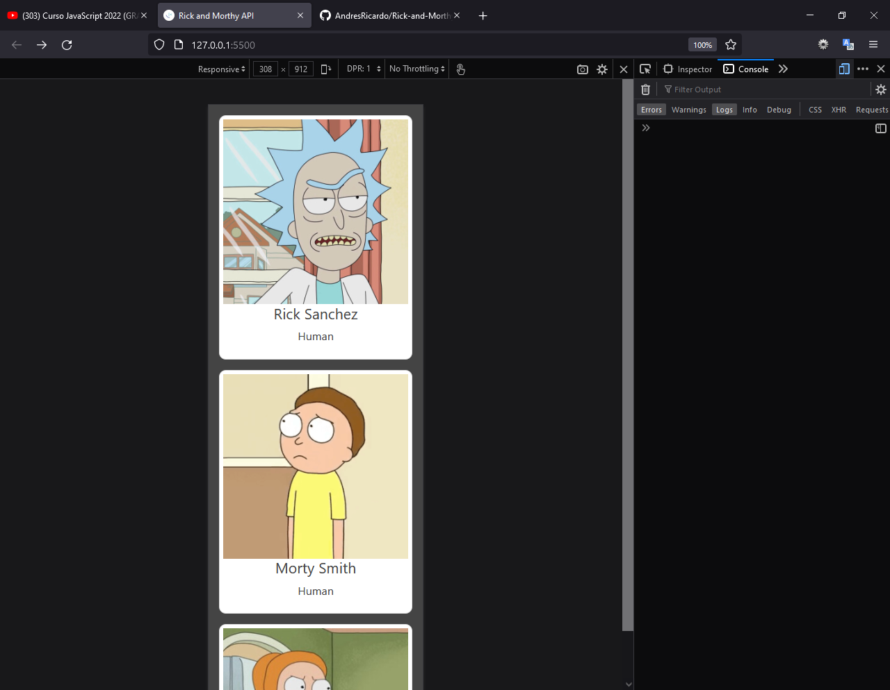
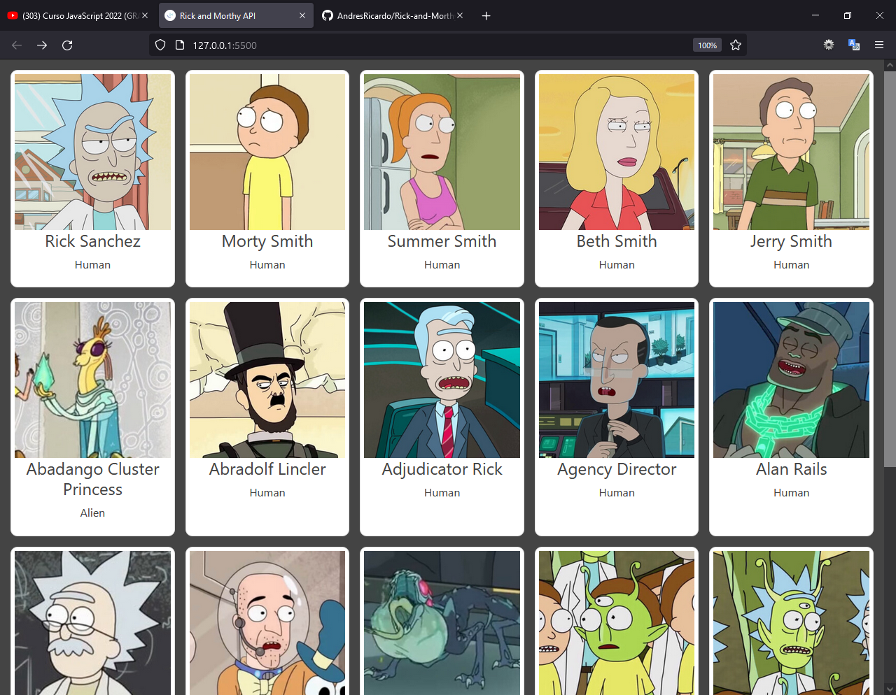
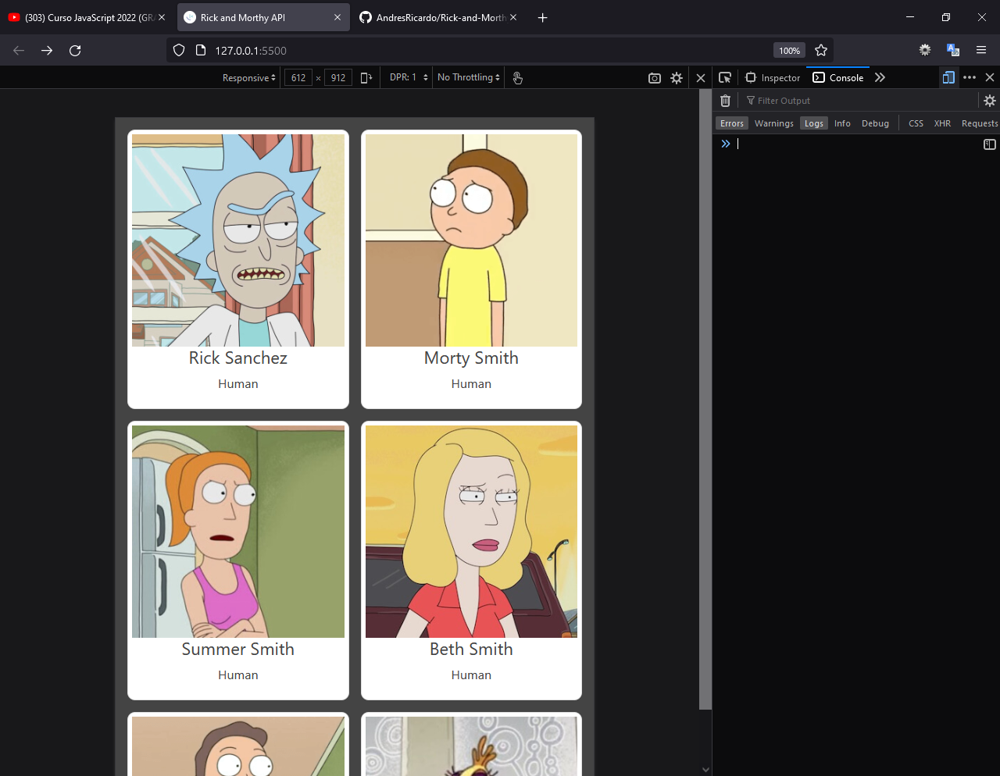

# Richi - Rick and Morthy for Practice API consuption

This is a small project to practice API concept.

## Table of contents

-   [Overview](#overview)
    -   [The challenge](#the-challenge)
    -   [Screenshot](#screenshot)
    -   [Links](#links)
    -   [Built with](#built-with)
    -   [What I learned](#what-i-learned)
    -   [Continued development](#continued-development)
    -   [Useful resources](#useful-resources)
-   [Author](#author)
-   [Acknowledgments](#acknowledgments)

## Overview

This project was made using just HTML, CSS (SASS, Flexbox and Grid) and JavaScrip. The general idea of pfoject is to print in screen a series of cards with information an images from and external API (https://rickandmortyapi.com/api/character).

### The challenge

Users should be able to:

-   View the optimal layout for the app depending on their device's screen size

### Screenshot

-   Mobile version screenshot



-   Destop version screenshot
    

-   Tablet version screenshot
    

### Links

-   Solution URL: [Github repository](https://github.com/AndresRicardo/Rick-and-Morthy-API.git)
-   Live Site URL: [Github page](https://andresricardo.github.io/Rick-and-Morthy-API/)

### Built with

-   Semantic HTML5 markup
-   CSS custom properties
-   Css Flexbox
-   Css Grid
-   Css pre-processor sass
-   JavaScript
-   Mobile-first workflow

### What I learned

doing this challenge i learned basic of API consuption and JSON file and use.

```javascript
//evento que indica cuando se ha termiando de cargar todo el DOM
document.addEventListener("DOMContentLoaded", () => {
    fetchData();
});

const fetchData = async () => {
    try {
        loadingData(true);

        const res = await fetch("https://rickandmortyapi.com/api/character");
        const data = await res.json();

        pintarData(data);
    } catch (error) {
        console.log("error");
    } finally {
        loadingData(false);
    }
};

//mostrar/ocultar spinner de carga
const loadingData = (estado) => {
    const loading = document.querySelector("#loading");

    if (estado) {
        loading.classList.remove("d-none");
        loading.classList.add("d-flex");
    } else {
        loading.classList.remove("d-flex");
        loading.classList.add("d-none");
    }
};

const pintarData = (data) => {
    const container = document.querySelector("#container");
    const templateCard = document.querySelector("#templateCard").content;
    const fragment = document.createDocumentFragment();

    data.results.forEach((item) => {
        const clone = templateCard.cloneNode(true);

        clone.querySelector(".cardImage img").src = item.image;
        clone.querySelector("h4").textContent = item.name;
        clone.querySelector("p").textContent = item.species;

        //colocamos primero todo en el fragment para evitar el reflow
        fragment.appendChild(clone);
    });

    container.appendChild(fragment);
};
```

### Continued development

Even if to me is more complex design mobile first, i will continue develop of this way.
By now in short time, my next skills to develop are css post-processors (postcss), deeping in javascript, typescript and start with angular.

### Useful resources

-   [Developer mozilla](https://developer.mozilla.org/es/docs/Web/CSS/) - This helped me like general reference.

## Author

-   Website - [Richi](https://github.com/AndresRicardo)

## Acknowledgments

To my mom and dad jajajajja.
